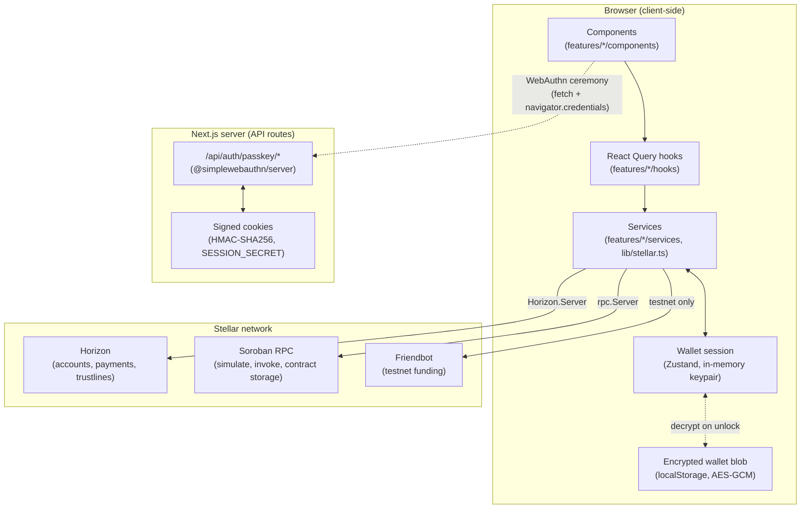

# Architecture

## Summary

This is a **client-first wallet**: almost everything runs in the browser, talking directly to
Stellar's public infrastructure (Horizon for classic operations, Soroban RPC for contracts).
There is no application database and no backend business logic — the one exception is a small
slice of server-side code dedicated to passkey (WebAuthn) verification, which genuinely
requires a trusted server to be meaningful. Wallet secrets never leave the device: the Stellar
keypair is encrypted client-side and decrypted into memory only, never sent anywhere.

## Diagram

## Layering, and why it's split this way

**`components` → `hooks` → `services`** is a one-directional dependency chain enforced by
convention (not a lint rule, but consistently followed): components own presentation and local
form state, hooks own React Query wiring (caching, invalidation, mutation state), services own
the actual Stellar/Soroban SDK calls and contain zero React. A service function can be
called from a Node script for testing or debugging without any React runtime — every SDK
integration in this app was verified that way against real testnet data before being wired
into the UI.

**`lib/stellar.ts`** is the one place that constructs and caches SDK clients
(`Horizon.Server`, `rpc.Server`, the Wallet SDK's `Wallet` instance) and holds logic reusable
across features (balance mapping, payment history mapping, error translation). Feature
`services/` files call into it rather than constructing their own clients, so there's exactly
one Horizon connection and one RPC connection per network, shared by every feature.

**One query key convention, shared across features.** Dashboard balances, trustlines, and
transaction history all key off `["account-overview", network, publicKey]` — mounting multiple
cards that need overlapping account data costs exactly one Horizon call, not one per card.
Mutations that change on-chain state (send, add/remove trustline) invalidate that key on
success so the dashboard reflects the change immediately instead of waiting for the next poll.

**Why passkey auth needs a server, when nothing else does.** WebAuthn's security model
depends on a challenge that's generated once, used once, and verified by a party the browser
can't tamper with — none of which a pure client-side implementation can honestly provide (a
compromised page script could just skip verification). The API routes under
`src/app/api/auth/passkey/` are a deliberately minimal exception to the "no backend" rule for
exactly this reason. There's still no database: the registered credential itself is stored in
a signed (not encrypted — WebAuthn public keys aren't secret) cookie rather than a database
row, since a WebAuthn public key's security property is _unforgeability_, which HMAC signing
provides without needing persistence infrastructure this app otherwise has no use for. See
[`src/features/auth/README.md`](../src/features/auth/README.md) for the full security
write-up.

## Network selection

Every service function takes a `network: "testnet" | "mainnet"` parameter explicitly — there's
no ambient global network state read deep inside the SDK layer. The active network lives in
one Zustand store (`src/stores/network-store.ts`) and flows down through hooks into service
calls; switching it is just a Zustand `set()`, and every query/mutation picks it up on the
next render since network is part of every query key.
